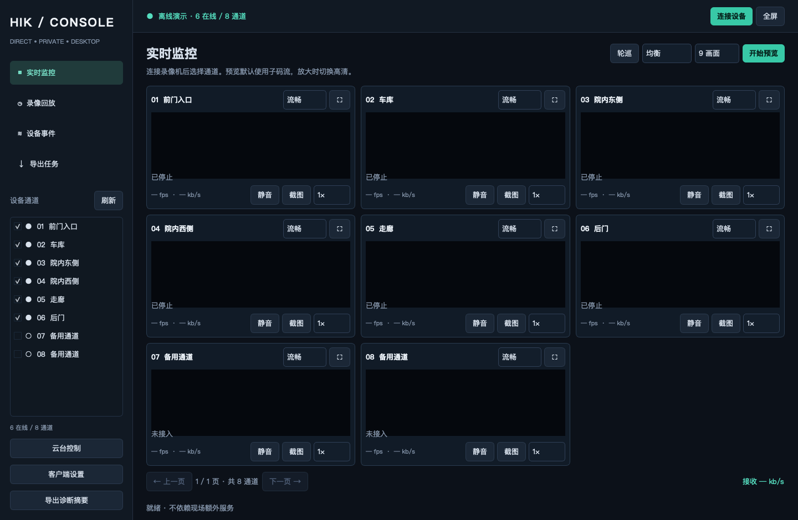

# Hikvision Console

直接连接海康 NVR 的原生桌面监控工作台，支持 macOS、Windows、Linux。视频经过你已有的局域网或 WireGuard 网络；NVR 和现场路由器不需要安装软件。



## 当前功能

- 动态发现全部通道，区分在线、离线、未接入；不限制为 6 路或 8 路。
- 1 / 4 / 9 / 16 画面分页、自动轮巡、单路放大、全屏、主子码流切换、音频、截图、中心数字放大。
- 源端码率预算和并发控制、分批建立连接、故障重连、卡帧检测、硬件解码失败后回退软件解码。
- 录像按通道、日期检索，完整分页、录像时间轴、滚轮缩放、时间定位、暂停、倍速、跨片段连续播放、录像空缺提示。
- 多路联动回放：一起定位和暂停，保留各通道录像空缺；不是逐帧同步。
- MP4 原视频编码导出，音频转 AAC；跨录像文件分段保存，单任务队列、进度、取消和重试。
- 设备事件订阅、事件列表导出、硬盘状态、可用能力检测、短时云台移动并自动停止。
- 保存地址、账号、端口、布局、通道选择和客户端设置；密码只在当前会话保存。

实时预览默认拉子码流，放大时切主码流。隐藏的预览页不继续拉流。带宽预算根据设备配置估算，不等同于网络测速；不能修复运营商或源端的实际丢包。

画面上的 `kbps / Mbps` 表示媒体接收比特率（8 bit = 1 Byte），不包含 WireGuard 等协议的额外流量。部分 NVR 会限制并发录像读取：本次实测第二路 RTSP 回放返回 453，遇到此提示应减少联动通道。导出会先释放当前播放连接，再串行读取录像。

## 启动

### 已打包应用

直接从 [Releases](https://github.com/k0ngk0ng/hikvision-console/releases/latest) 下载对应系统的压缩包。推送 `vMAJOR.MINOR.PATCH` 标签后，Actions 会在三平台构建检查全部成功、版本和 SHA-256 校验通过后发布 Release，并附上安装包、校验文件和构建记录。发布说明位于 `docs/releases/`；标签版本必须与应用版本一致。

三平台构建由 [GitHub Actions](https://github.com/k0ngk0ng/hikvision-console/actions/workflows/desktop.yml) 执行。每个平台通过测试后提供带系统/架构名称的压缩包、SHA-256 校验文件和构建记录。下载 Actions artifact 后，还需解压里面的应用压缩包；保留 macOS/Linux 的执行权限。

Actions 当前构建 macOS Apple Silicon ARM64、Windows x64 和 Linux x86_64。Intel Mac 需要在 Intel Mac 上从源码构建。Windows/Linux 执行打包后原生播放检查；GitHub 的 macOS ARM/Intel runner 均无法创建 VLC 所需的 OpenGL 上下文，因此 macOS 云端只验证 Qt/VLC 组件加载与 FFmpeg 解码，构建 JSON 明确标记 `native_rendering_tested: false`。完整 macOS 原生播放检查需在真实 Mac 执行，本项目已完成本地验证。

macOS / Windows 安装包可包含 VLC 和 FFmpeg，无需 Python。Linux 构建使用系统 VLC，需要安装 `vlc` / `libvlc5`，并有 X11 或 XWayland。各平台必须在对应平台构建，不能把 macOS 构建当作 Windows 安装包。

首次启动会出现“连接 NVR”窗口。以后使用右上角“连接设备”填写或切换设备。地址只填 IP 或主机名，不要加 `http://`。

“客户端设置”提供网络模式之外的带宽预算、同时预览上限、硬件解码、TCP/UDP、录像时间兼容模式，以及截图/导出目录。这里不会修改 NVR 编码和录像计划。

### 从源码运行

需要 Python 3.11+、VLC 3.x（与 Python 架构匹配）。项目使用 Python 的 Qt 绑定 PySide6。

macOS / Linux：

```sh
./run.sh
```

Windows PowerShell：

```powershell
./run.ps1
```

首次运行脚本会在项目内创建 `.venv` 并安装依赖。推荐预先安装 `uv`；也可以用 `python -m venv` 和 pip。VLC 在 macOS 默认从 `/Applications/VLC.app` 加载，在 Windows 从 `C:/Program Files/VideoLAN/VLC` 加载。自定义位置设置 `HIKVISION_VLC_DIR`（macOS 指向 VLC.app/Contents/MacOS）。

Linux 安装示例（在目标机器由使用者执行）：

```sh
sudo apt install vlc libvlc5 ffmpeg libxcb-cursor0 libxkbcommon-x11-0
./run.sh
```

Linux 强制使用 Qt xcb；Wayland 桌面需启用 XWayland。没有图形会话的服务器不适合运行客户端。

## 使用说明

1. 连接 NVR，确认左侧通道状态。
2. 选择要观看的通道，点击“开始预览”。选择网络模式；预算不足的画面会明确显示暂停原因。
3. 单路右上角放大按钮会切换高清；“返回网格”恢复子码流。全屏使用 F11，Esc 返回。
4. 在“录像回放”选择通道和日期，检索后点击绿色时间轴或双击录像片段。时间显示使用 **NVR 时区**。
5. 倍速通过 RTSP Scale 请求设备，同时调整本地播放速率。实际速度取决于设备和链路，设备拒绝时会显示错误。
6. “导出片段”选取时间范围。默认保留视频编码，因此播放器需要支持源视频的 H.264/H.265；原始质量导出起点受关键帧限制，不是逐帧精确剪辑。
7. 云台功能先检测实际能力。没有云台的摄像头不能通过软件获得物理转动能力。对讲不在此版本中开放；实测 NVR 报告的对讲通道数为 0。

## 旧固件录像时间

部分海康固件把本地时间标为 `Z`。本项目已经在 DS-7108N-F1/8P(C)、V4.31.102 上实际确认该行为。客户端探测明显落在“未来”的近期录像来识别这种模式，搜索、回放和导出统一转换。自动探测无法覆盖所有设备历史校时情况；可在设置中明确选择“标准 UTC”或“旧固件：本地时间标记为 Z”，保存后重新读取设备。

旧设备的 RTSP 数据包在长时间测试中触发了 libVLC/live555 接收兼容问题，回放还缺少有效播放时钟。因此，实时和回放统一由客户端 FFmpeg 子进程接收，将原视频转封装为 MPEG-TS，在随机令牌保护的 `127.0.0.1` HTTP 端口送给原生播放器。每路只有一条到 NVR 的连接，视频不重编码、不写临时录像、不向局域网开放服务；音频按需转 AAC。倍速使用另一个仅回环可访问的 RTSP Scale 适配器。现场仍然只需要 NVR 和现有网络转发。FFmpeg 的认证地址通过管道传递，不出现在子进程参数中。

## 数据与凭据

- 源码运行的配置、截图、导出默认在当前目录 `.hikvision-console/`；安装包使用操作系统的应用数据目录。可通过 `HIKVISION_HOME` 明确指定数据目录。
- 密码不写入配置、诊断或安装包。开发专用 `--connect` 可从 `NVR_PASSWORD` 环境变量或工作目录 `.nvrpass` 读取密码。普通启动不会读取该文件。
- 诊断摘要只包含设备型号、通道状态、编码信息和播放计数。截图与导出的录像属于监控内容，应自行保管。
- 所有测试图像和片段在 `artifacts/private/`，不会纳入源码或应用构建。

## 开发与验证

```sh
UV_CACHE_DIR="$PWD/.cache/uv" TMPDIR="$PWD/.tmp" uv pip install --python .venv/bin/python -e '.[dev]'
QT_QPA_PLATFORM=offscreen TMPDIR="$PWD/.tmp" .venv/bin/pytest -q
.venv/bin/ruff check src tests scripts
.venv/bin/python -m hikvision_console --demo
.venv/bin/python scripts/build.py
```

真实设备验证需要主动运行，不属于默认测试：

```sh
.venv/bin/python scripts/live_verify.py --channels 1,2,3,4,5,6 --seconds 90
.venv/bin/python scripts/live_verify.py --channels 1 --playback-minutes-ago 40 --seconds 60
.venv/bin/python scripts/live_verify.py --channels 1 --playback-minutes-ago 40 --speed 2 --seconds 60
.venv/bin/python scripts/verify_export.py
```

这些脚本只读设备及既有录像，不改变 NVR 配置。`--snapshot` 会在本地保存监控截图，仅在需要时使用。硬件解码可用 `--hardware` 单独验证。

构建产物在 `dist/`。macOS 构建默认仅本地 ad-hoc 签名；公开分发需要发布者自己的签名与公证凭据。Windows 同理。参考 [实现与验证记录](docs/IMPLEMENTATION.md) 和 [第三方组件](THIRD_PARTY.md)。

Linux 构建还需要 `binutils`（提供 PyInstaller 所需的 `objdump`）；自动化原生播放测试需要 `xvfb` 和 `xauth`。
